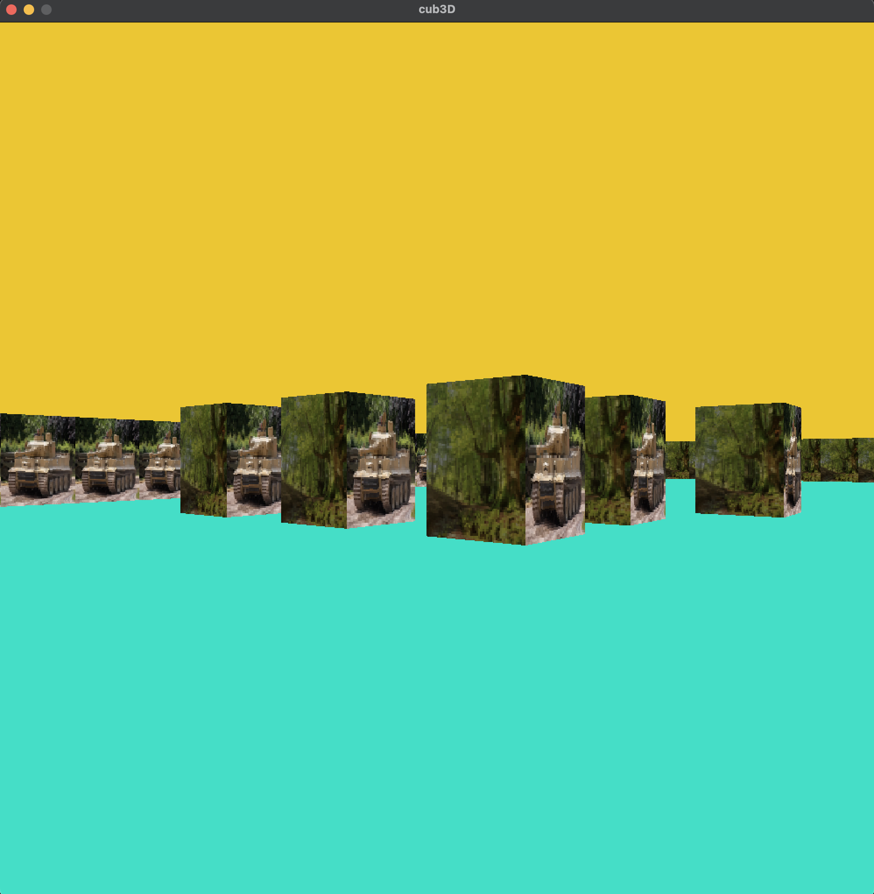
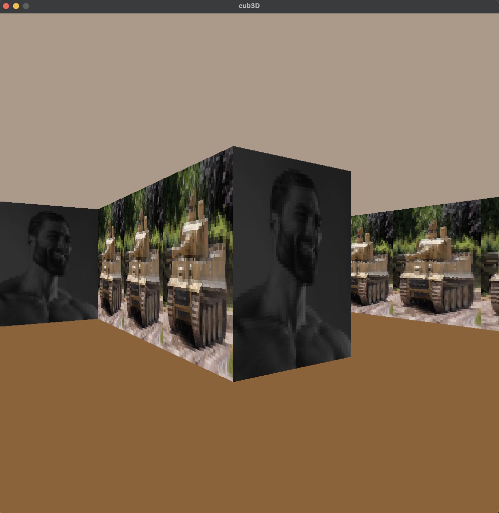

# cub3D

`cub3D` is a minimal Wolfenstein-like raycasting engine built for the 42 curriculum. It parses `.cub` configuration files, validates the level with a DFS-based flood fill, and renders textured walls in real time through [MLX42](https://github.com/codam-coding-college/MLX42).

- **Language / toolchain**: C17, `cc`, `MLX42`, custom `tym_libft`
- **Target**: macOS or Linux with GLFW support
- **Resolution**: `1000x1000` window defined in `include/cub3d.h`

---

## Quick Start

### 1. Prerequisites
- C compiler with `-Wall -Wextra -Werror -pedantic` support
- `cmake` >= 3.15 (used to build MLX42)
- `glfw` development package (`brew install glfw` on macOS, `sudo apt install libglfw3-dev` on Ubuntu)

### 2. Build
```bash
make            # builds tym_libft, MLX42, and the cub3D binary
```

### 3. Run
```bash
./cub3D maps/good/subject_map.cub
```

Use `make clean` / `make fclean` / `make re` as usual. MLX42 is compiled into `MLX42/build` automatically.

---

## Repository Layout

| Path            | Description |
|-----------------|-------------|
| `src/parser/`   | File loader: config parsing, map assembly, and validation. |
| `src/raycast/`  | DDA-based ray casting, texture lookup, and shading. |
| `src/render/`   | MLX42 loop hook, input polling, frame buffer utilities. |
| `src/player/`   | Player creation, movement, collision, rotation. |
| `src/cleaner/`  | Centralized resource cleanup and error helpers. |
| `include/`      | Shared structs, enums, and module headers. |
| `maps/good`     | Valid sample maps for experimentation. |
| `maps/bad`      | Rejection cases to stress the parser. |
| `textures/`     | PNG textures referenced by the sample `.cub` files. |
| `tym_libft/`    | Custom libft bundle (libft, ft_printf, get_next_line). |
| `MLX42/`        | Git submodule delivering the graphical backend. |

---

## Controls & Gameplay
- `W / A / S / D` – translate the player.
- `← / →` – rotate the camera.
- `ESC` – close the window.

Collision is handled with a configurable `COLLISION_MARGIN` to avoid clipping through walls while still allowing the player to slide along them.

---

## Map Format

A `.cub` file is split into configuration and map payload separated by an empty line.

```text
NO textures/forest1.png
SO textures/forest2.png
WE textures/forest3.png
EA textures/tiger1.png

F 220,100,0
C 225,30,0

1111111111111
1000000000001
10N0000000001
1111111111111
```

### Rules enforced by the parser
1. **Header**: exactly one line per texture (NO, SO, EA, WE) and RGB color (F, C). Paths must end with `.png`.
2. **Spacing**: blank lines between headers and map body are allowed and skipped.
3. **Map grid**:
   - Allowed tokens: `1` (wall), `0` (floor), `N`, `E`, `S`, `W` (player spawn), and spaces for padding.
   - Exactly one spawn token must exist; duplicates trigger the `PLAYER_SET` flag and abort.
   - Every row must contain at least one `1`/`0` so empty rows never sneak into the grid.

### Validation strategy
- The engine stores the map as a flexible `char **` plus explicit width/height fields.
- `check_map()` (see `src/parser/check_map.c`) measures the widest row, allocates a bitset for visited flags, and runs a DFS using an explicit stack.
- If the DFS walks out of bounds or touches a `' '` (void), the map is rejected because it is not enclosed.

---

## Rendering & Game Logic

### Engine bootstrapping
1. `init_engine()` allocates the master `t_engine` structure and zeroes substructures (map, player, RGB entries).
2. `parser()` validates the CLI argument (`.cub` extension), reads configuration lines through `get_next_line`, and sets bit flags for each resource.
3. Once parsing and DFS validation pass, `create_player()` swaps the spawn token for `0` and initializes direction/plane vectors.

### Input → Movement → Collision
- `render.c` registers `render_loop()` with `mlx_loop_hook`.
- Each tick `process_input()` polls MLX42 keys. Movement requests are translated into vector steps based on the player's forward (`dx`, `dy`) and perpendicular plane.
- `move_player()` tries to advance independently on X and Y with a small buffer (`COLLISION_MARGIN`). It samples the map through `get_tile()` to keep the player inside walkable tiles.
- `rotate_player()` performs a 2D rotation on both the direction vector and the camera plane to keep the FOV perpendicular.

### Ray casting pipeline
1. For each column `x` in the frame, `raycast_scene()` calls `init_ray()` which:
   - Projects the column into the camera plane (`camera_x`) and derives the ray direction by mixing the player's direction and plane vectors.
   - Pre-computes delta distances for the DDA.
2. `trace_ray()` runs the DDA: advance on the axis with the smaller side distance until a wall (`'1'`) is hit. If we ever reach a `' '` or go out of bounds the ray is discarded (bad map defense).
3. The perpendicular distance is cached to avoid fisheye distortions.
4. `draw_scene()` splits the column into ceiling/wall/floor:
   - Computes the visible wall slice (`line_height`, `draw_start`, `draw_end`).
   - `draw_wall_column()` chooses a texture based on hit orientation (`t_textures_dir` enum) and performs vertical sampling. North/south walls are darkened by halving RGB values to create simple shading.
   - Ceiling/floor rows fill the remaining pixels via `rgba_from_rgb()`.

### Resource lifetime
- Textures are loaded lazily the first time a ray hits their orientation, keeping startup fast.
- All allocations funnel through `free_struct()` which:
  - Releases MLX images/textures.
  - Frees the linked lists created during parsing (`ft_free_i_data` on the map grid).
  - Calls `mlx_terminate()` and nulls pointers before leaving `main()`.

---

## Assets & Sample Maps
- Browse `maps/good/` to test different FOV scenarios (narrow corridors, open rooms, whitespace padding).
- `maps/bad/` are regression cases that should fail: missing textures, RGB overflow, holes in walls, multiple players, invalid characters, etc. Running them is helpful when extending the parser.
- Drop additional `.png` textures into `textures/` and reference them from your map headers.

---

## Gallery (drop in your screenshots)

> Store captures inside `docs/images/` (create the folder if it does not exist) and update the paths below.

<p align="center">
  
</p>

<p align="center">
  
</p>

<p align="center">
  
</p>

---

Made with ☕ by the team behind `fkarika` and `tmateja`. Enjoy wandering the maze!
